# AWS RDS Lab

<div align="center">
  
</div>

---

## Step 1: Create the VPC
```bash
aws ec2 create-vpc \
  --cidr-block 10.0.0.0/16 \
  --tag-specifications 'ResourceType=vpc,Tags=[{Key=Name,Value=LAB-VPC}]'
```

<div align="center">
  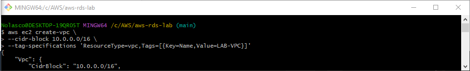
</div>

---
## Step 2: Create Subnets
Public Subnet 1 (AZ A)
```bash
aws ec2 create-subnet \
  --vpc-id <vpc-id> \
  --cidr-block 10.0.1.0/24 \
  --availability-zone <AZ-A> \
  --tag-specifications 'ResourceType=subnet,Tags=[{Key=Name,Value=PublicSubnet1}]'
```

<div align="center">
  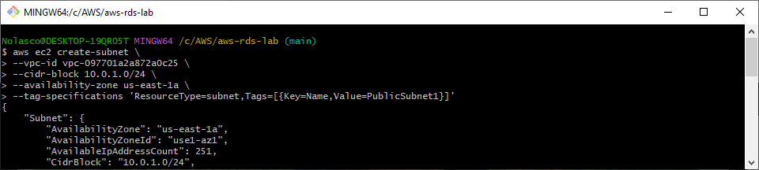
</div>

#

Public Subnet 2 (AZ B)
```bash
aws ec2 create-subnet \
  --vpc-id <vpc-id> \
  --cidr-block 10.0.2.0/24 \
  --availability-zone <AZ-B> \
  --tag-specifications 'ResourceType=subnet,Tags=[{Key=Name,Value=PublicSubnet2}]'
```

<div align="center">
  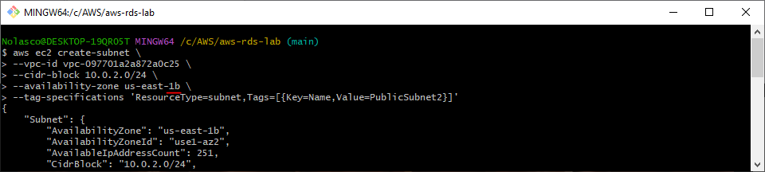
</div>

#

Private Subnet 1 (AZ A)
```bash
aws ec2 create-subnet \
  --vpc-id <vpc-id> \
  --cidr-block 10.0.3.0/24 \
  --availability-zone <AZ-A> \
  --tag-specifications 'ResourceType=subnet,Tags=[{Key=Name,Value=PrivateSubnet1}]'
```

<div align="center">
  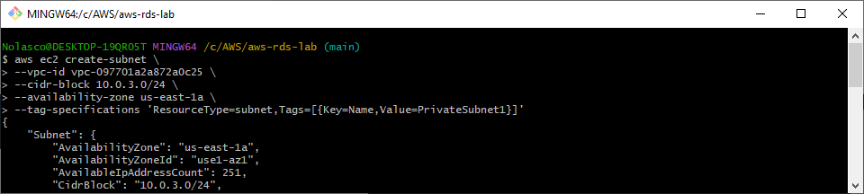
</div>

#

Private Subnet 2 (AZ B)
```bash
aws ec2 create-subnet \
  --vpc-id <vpc-id> \
  --cidr-block 10.0.4.0/24 \
  --availability-zone <AZ-B> \
  --tag-specifications 'ResourceType=subnet,Tags=[{Key=Name,Value=PrivateSubnet2}]'
```

<div align="center">
  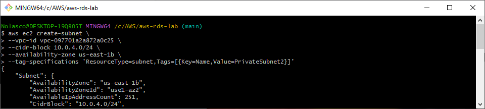
</div>

---
## Step 3: Create and Attach Internet Gateway
```bash
aws ec2 create-internet-gateway \
  --tag-specifications 'ResourceType=internet-gateway,Tags=[{Key=Name,Value=LAB-IGW}]'
```

<div align="center">
  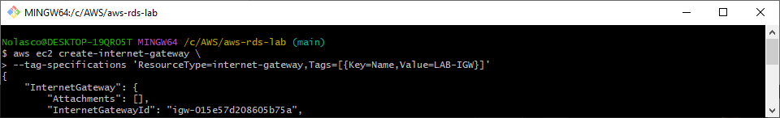
</div>

```bash
aws ec2 attach-internet-gateway \
  --vpc-id <vpc-id> \
  --internet-gateway-id <internet-gateway-id>
```

<div align="center">
  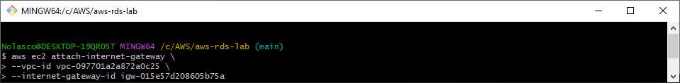
</div>

---
## Step 4: Create Route Tables
Public Route Table
```bash
aws ec2 create-route-table \
  --vpc-id <vpc-id> \
  --tag-specifications 'ResourceType=route-table,Tags=[{Key=Name,Value=PublicRouteTable}]'
```

<div align="center">
  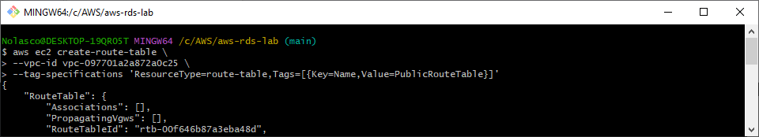
</div>

```bash
aws ec2 create-route \
  --route-table-id <public-route-table-id> \
  --destination-cidr-block 0.0.0.0/0 \
  --gateway-id <internet-gateway-id>
```

<div align="center">
  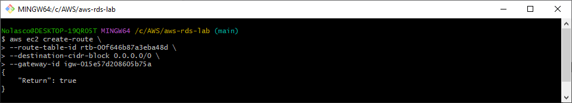
</div>

```bash
aws ec2 associate-route-table \
  --route-table-id <public-route-table-id> \
  --subnet-id <PublicSubnet1-id>
```

<div align="center">
  
</div>

```bash
aws ec2 associate-route-table \
  --route-table-id <public-route-table-id> \
  --subnet-id <PublicSubnet2-id>
```

<div align="center">
  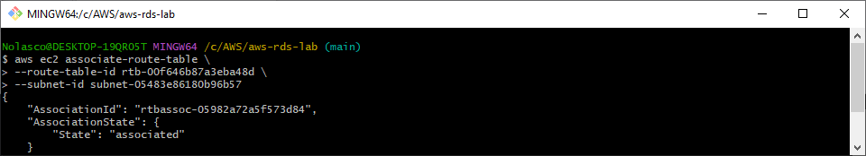
</div>

#

Private Route Table
```bash
aws ec2 create-route-table \
--vpc-id <vpc-id> \
--tag-specifications 'ResourceType=route-table,Tags=[{Key=Name,Value=PrivateRouteTable}]'
```

<div align="center">
  
</div>

---
## Step 5: Create NAT Gateway
```bash
aws ec2 allocate-address --domain vpc
```

<div align="center">
  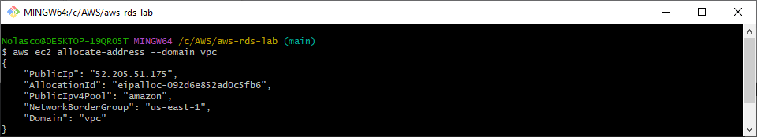
</div>

```bash
aws ec2 create-nat-gateway \
  --subnet-id <PublicSubnet1-id> \
  --allocation-id <allocation-id> \
  --tag-specifications 'ResourceType=natgateway,Tags=[{Key=Name,Value=LAB-NATG}]'
```

<div align="center">
  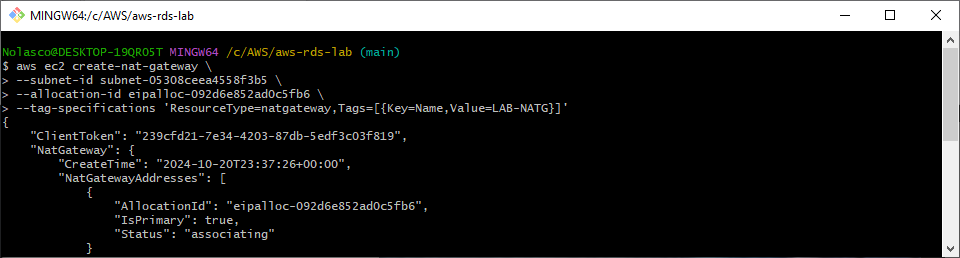
</div>

```bash
aws ec2 create-route \
  --route-table-id <private-route-table-id> \
  --destination-cidr-block 0.0.0.0./0 \
  --nat-gateway-id <nat-gateway-id>
```

<div align="center">
  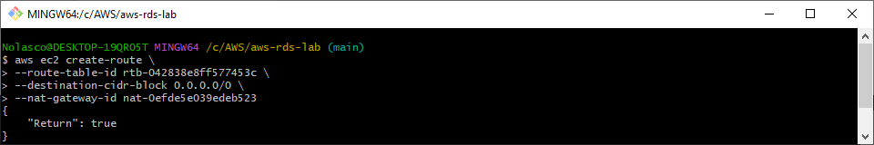
</div>

---
## Step 6: Create Security Groups
Web Server (EC2) Security Group
```bash
aws ec2 create-security-group \
  --group-name WebServer-SG \
  --description "Allow HTTP and SSH" \
  --vpc-id <vpc-id>
```

<div align="center">
  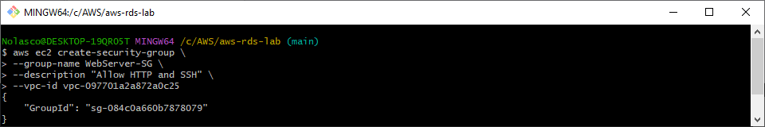
</div>

```bash
aws ec2 authorize-security-group-ingress \
  --group-id <WebServer-SG-ID> \
  --protocol tcp \
  --port 22 \
  --cidr <MY-PUBLIC-IP>/32
```

<div align="center">
  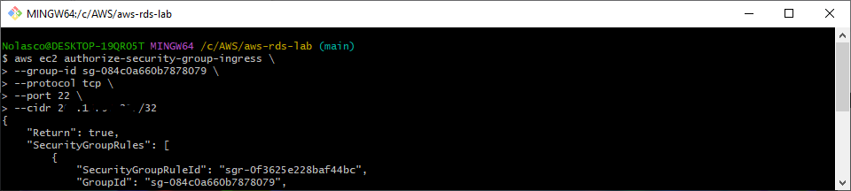
</div>

```bash
aws ec2 authorize-security-group-ingress \
  --group-id <WebServer-SG-ID> \
  --protocol tcp --port 80 \
  --cidr <MY-PUBLIC-IP>/32
```

<div align="center">
  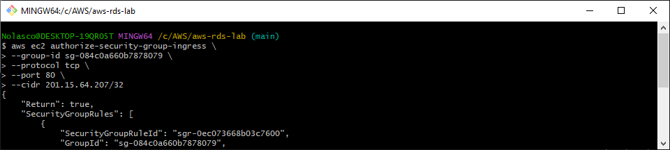
</div>

#

RDS Security Group
```bash
aws ec2 create-security-group \
  --group-name RDS-SG \
  --description "Allow MySQL access" \
  --vpc-id <vpc-id>
```

<div align="center">
  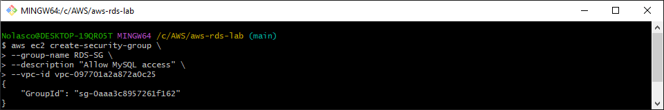
</div>

```bash
aws ec2 authorize-security-group-ingress \
  --group-id <RDS-SG-ID> \
  --protocol tcp \
  --port 3306 \
  --source-group <WebServer-SG-ID>
```

<div align="center">
  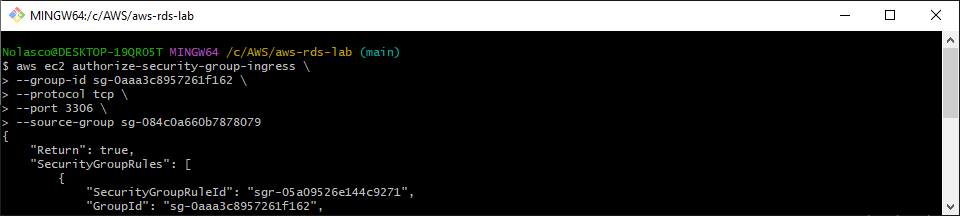
</div>

---
## Step 7: Launch the EC2 Instance (Web Server)
```bash
aws ec2 create-key-pair \
  --key-name <KeyPairName> \
  --query 'KeyMaterial' \
  --output text > <KeyPairName>.pem
```

<div align="center">
  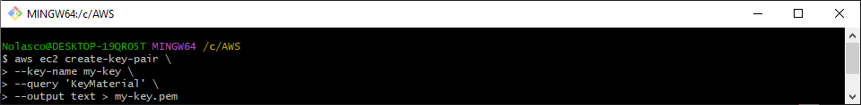
</div>

- **AMI Suggestion:** `ami-0ebfd941bbafe70c6`. [Find an AMI](https://docs.aws.amazon.com/AWSEC2/latest/UserGuide/finding-an-ami.html)
```bash
aws ec2 run-instances \
  --image-id <ami-id> \
  --instance-type t2.micro \
  --key-name <KeyPairName> \
  --security-group-ids <WebServerSG-ID> \
  --subnet-id <PublicSubnet2Id> \
  --associate-public-ip-address \
  --user-data file://setup.sh \
  --tag-specifications 'ResourceType=instance,Tags=[{Key=Name,Value=LAB-WS}]'
```

<div align="center">
  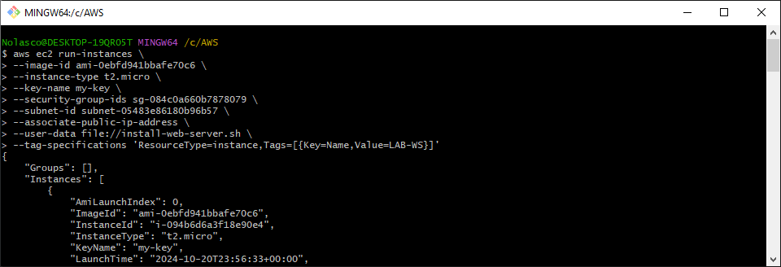
</div>

---
## Step 8: Create RDS Database (Multi-AZ)
```bash
aws rds create-db-subnet-group \
  --db-subnet-group-name <MyDBSubnetGroup> \
  --subnet-ids <PrivateSubnet1-id> <PrivateSubnet2-id> \
  --db-subnet-group-description "My DB Subnet Group"
```

<div align="center">
  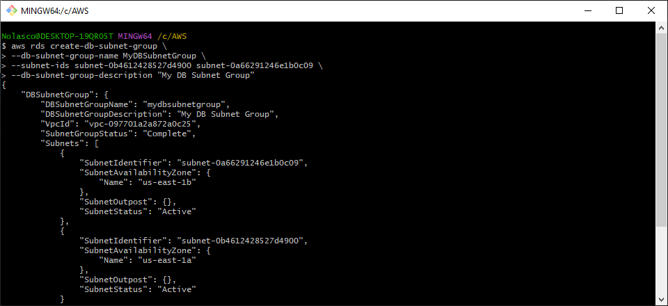
</div>

```bash
aws rds create-db-instance \
  --db-instance-identifier MyDBInstance \
  --db-instance-class db.t3.micro \
  --engine mysql \
  --allocated-storage 20 \
  --master-username admin \
  --master-user-password password \
  --vpc-security-group-ids <RDS-SG-ID> \
  --db-subnet-group-name <MyDBSubnetGroup> \
  --multi-az 
```

<div align="center">
  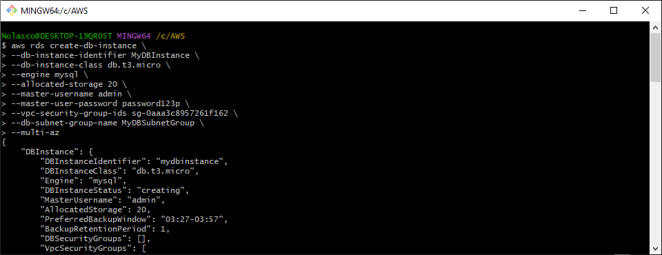
</div>

#

- It takes a few minutes until the instance is launched
```bash
aws rds describe-db-instances \
--db-instance-identifier MyDBInstance \
--query "DBInstances[*].[Endpoint.Address,AvailabilityZone,PreferredBackupWindow,BackupRetentionPeriod,DBInstanceStatus]"
```

<div align="center">
  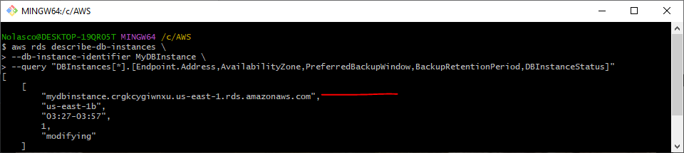
</div>

---
## Step 9: Test the Connection
```bash
aws ec2 describe-instances \
  --instance-ids <instance-id> \
  --query 'Reservations[*].Instances[*].PublicIpAddress' \
  --output text
```

<div align="center">
  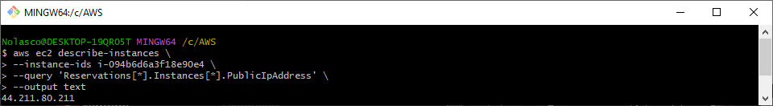
</div>

```bash
ssh -i <KeyPairName>.pem ec2-user@<PublicIpAddress>
```

<div align="center">
  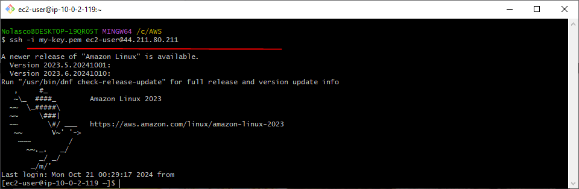
</div>

```bash
mysql -h <RDS_ENDPOINT> -u admin -p
```

<div align="center">
  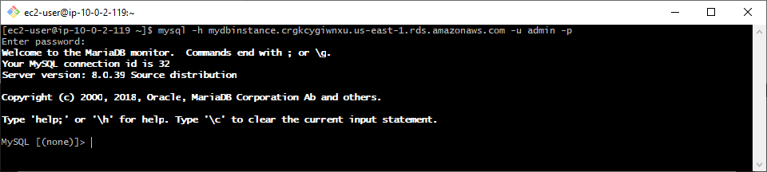
</div>

---
## Step 10: Clean Up Resources
Terminate the EC2 instance
```bash
aws ec2 terminate-instances --instance-ids <instance-id>
```

<div align="center">
  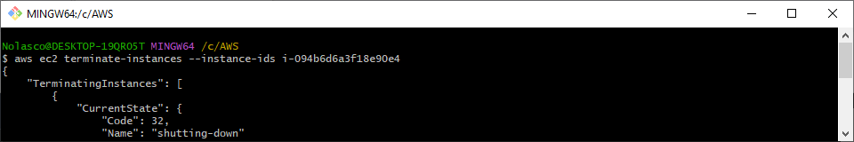
</div>

#

Delete the RDS database
```bash
aws rds delete-db-instance --db-instance-identifier <MyDBInstance> --skip-final-snapshot
```

<div align="center">
  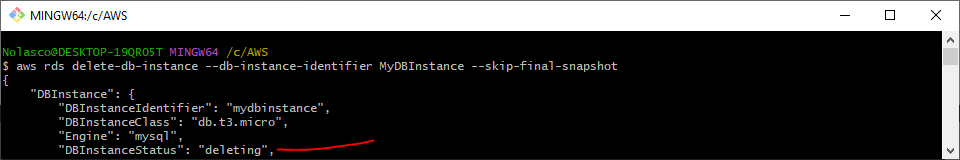
</div>

#

Delete NAT Gateway
```bash
aws ec2 delete-nat-gateway --nat-gateway-id <nat-gateway-id>
```

<div align="center">
  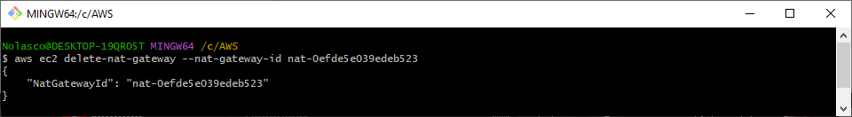
</div>

#

Detach and Delete Internet Gateway
```bash
aws ec2 detach-internet-gateway --internet-gateway-id <igw-id> --vpc-id <vpc-id>
```

<div align="center">
  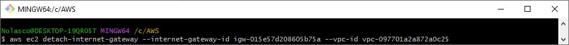
</div>

```bash
aws ec2 delete-internet-gateway --internet-gateway-id <igw-id>
```

<div align="center">
  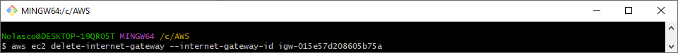
</div>

#

Delete DB Subnet Group
```bash
aws rds delete-db-subnet-group --db-subnet-group-name <your-db-subnet-group-name>
```

<div align="center">
  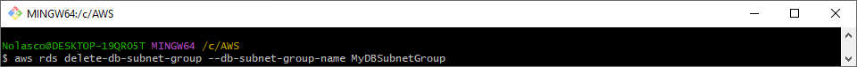
</div>

#

Delete Security Groups
```bash
aws ec2 delete-security-group --group-id <RDS-SG-ID>
aws ec2 delete-security-group --group-id <WebServer-SG-ID>
```

<div align="center">
  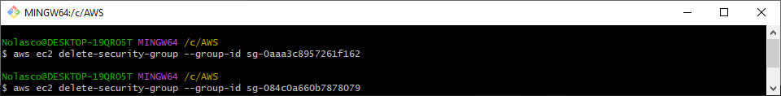
</div>

#

Release Elastic IP
```bash
aws ec2 release-address --allocation-id <allocation-id>
```

<div align="center">
  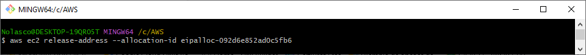
</div>

#

Delete Subnets
```bash
aws ec2 delete-subnet --subnet-id <PublicSubnet1Id>
aws ec2 delete-subnet --subnet-id <PublicSubnet2Id>
aws ec2 delete-subnet --subnet-id <PrivateSubnet1Id>
aws ec2 delete-subnet --subnet-id <PrivateSubnet2Id>
```

<div align="center">
  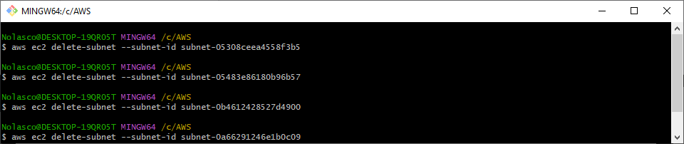
</div>

#

Delete Route Tables
```bash
aws ec2 delete-route-table --route-table-id <public-route-table-id>
aws ec2 delete-route-table --route-table-id <private-route-table-id>
```

<div align="center">
  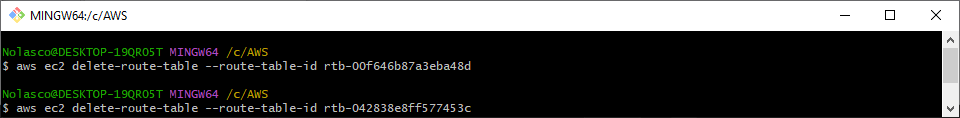
</div>

#

Delete VPC
```bash
aws ec2 delete-vpc --vpc-id <vpc-id>
```

<div align="center">
  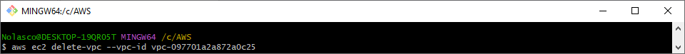
</div>
